# Gestor de Tareas
### Un resumen de Herramientas.

Para desarrollar nuestra aplicacion, hemos usado una interfaz grafica JavaFX para que interactue con el usuario, y tambien para las bases de datos hemos utilizado SQL con oracle y para el control de versiones hemos usado git y el repositorio se encuentra en la nube [GitHub](https://github.com/rifi45/Gestor-Tareas)

### El Diseño de Nuestra Aplicacion(Orientado a java)
Para lo referente al diagrama de clases, tenemos una clase Abstracta llamada tarea de la cual heredan dos subclases y implementan el metodo abstracto mostrarDetalles().

```mermaid
classDiagram
    class GestorTareas {
        - tareas: Stack<Tarea>
        +añadirTarea(Tarea tarea) : void
        +eliminarTarea() : Tarea
        +verTareasPendientes(): Stack<Tarea>
        +verTareasRealizadas(): Stack<Tarea>
        +ejecutarTarea(): void
        +ordenarPorPrioridad(): void
    }
    class Tarea {
        - nombre: String
        - Descripcion: String
        - fechaLimite: String
        - prioridad: int
        + mostrarDetalles(): void
    }

    class TareaPersonal {
       
    }

    class TareaTrabajo {
        
    }

    Tarea <|-- TareaPersonal
    Tarea <|-- TareaTrabajo
    GestorTareas <-- Tarea


```

### Bases de Datos

- **Adjunto aqui la creacion de mis tablas en SQL y la creacion de un trigger**

```sql

-- Creacion de tablas
create table tipo_tarea(
ID_TIPO_TAREA INTEGER PRIMARY KEY,
NOMBRE_TIPO VARCHAR(255) unique
);

create table tarea(
ID_TAREA INTEGER PRIMARY KEY,
NOMBRE VARCHAR(255) unique,
DESCRIPCION VARCHAR(255),
FECHA_LIMITE DATE,
PRIORIDAD INTEGER,
REALIZADA VARCHAR(2),
ID_TIPO_TAREA INTEGER,
FOREIGN KEY (ID_TIPO_TAREA) REFERENCES tipo_tarea(ID_TIPO_TAREA)
);

create table registro_tareas_realizadas(
ID_REGISTRO INTEGER PRIMARY KEY,
FECHA_REALIZACION DATE,
ID_TAREA INTEGER,
FOREIGN KEY (ID_TAREA) REFERENCES tarea(ID_TAREA)
);

--ALTERAR LA TABLA PARA QUE NOS GUARDE LA FECHA DE HOY.
ALTER TABLE registro_tareas_realizadas
MODIFY FECHA_REALIZACION TIMESTAMP DEFAULT CURRENT_TIMESTAMP;


--Secuencias para ir incrementando el id
CREATE SEQUENCE ID_TAREA
START WITH 1
INCREMENT BY 2;

CREATE SEQUENCE ID_REGISTRO
START WITH 1
INCREMENT BY 1;

-- insertar datos por defecto
insert into tipo_tarea values(1, 'Tarea Personal');
insert into tipo_tarea values(2, 'Tarea Trabajo');

--Creacion de un trigger para guardar las fechas y las tareas que se reaizaron

CREATE OR REPLACE TRIGGER registrar_tareas
AFTER UPDATE ON tarea
FOR EACH ROW
BEGIN
    IF:OLD.REALIZADA = 'NO' AND :NEW.REALIZADA = 'SI' THEN
    INSERT INTO registro_tareas_realizadas(ID_REGISTRO, ID_TAREA) VALUES(id_registro.NEXTVAL, :NEW.ID_TAREA);
    END IF;
END;
/

--Inserciones a la tabla de tarea
INSERT INTO TAREA(ID_TAREA, NOMBRE, DESCRIPCION, FECHA_LIMITE, PRIORIDAD, REALIZADA, ID_TIPO_TAREA) VALUES (ID_TAREA.NEXTVAL, 'Tarea Programacion', 'Añadir for al metodo comer()', '20/12/2023', 4, 'No', 2);
INSERT INTO TAREA(ID_TAREA, NOMBRE, DESCRIPCION, FECHA_LIMITE, PRIORIDAD, REALIZADA, ID_TIPO_TAREA) VALUES (ID_TAREA.NEXTVAL, 'Tarea Limpiar', 'Limpia tu despacho', '25/12/2023', 8, 'No', 1);
INSERT INTO TAREA(ID_TAREA, NOMBRE, DESCRIPCION, FECHA_LIMITE, PRIORIDAD, REALIZADA, ID_TIPO_TAREA) VALUES (ID_TAREA.NEXTVAL, 'Comprar ingredientes', 'Ir al supermercado y comprar ingredientes para cocinar la cena', '30/12/2023', 6, 'No', 1);
INSERT INTO TAREA(ID_TAREA, NOMBRE, DESCRIPCION, FECHA_LIMITE, PRIORIDAD, REALIZADA, ID_TIPO_TAREA) VALUES (ID_TAREA.NEXTVAL, 'Estudiar para examen', 'Repasar los apuntes y resolver ejercicios para el examen de matemáticas', '10/01/2024', 7, 'No', 1);
INSERT INTO TAREA(ID_TAREA, NOMBRE, DESCRIPCION, FECHA_LIMITE, PRIORIDAD, REALIZADA, ID_TIPO_TAREA) VALUES (ID_TAREA.NEXTVAL, 'Hacer ejercicio', 'Ir al gimnasio y realizar una rutina de entrenamiento', '05/01/2024', 5, 'No', 1);


--Seleccionar para ver las tareas.
select * from tarea;
```
### Prototipo de Interfaz de Usuario(Java FX)

Solo hay una ventana en la cual hay una tabla que realiza todas las funciones necesarias de nuestra app.