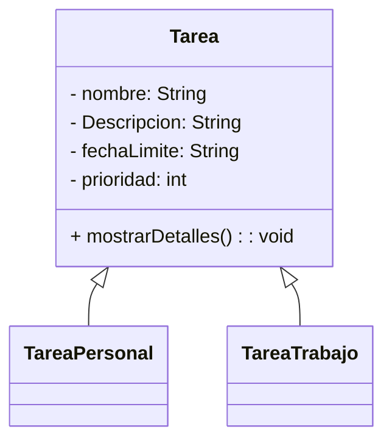

# Gestor de Tareas
### Un resumen de Herramientas.

Para desarrollar nuestra aplicacion, hemos usado una interfaz grafica JavaFX para que interactue con el usuario, y tambien para las bases de datos hemos utilizado SQL con oracle y para el control de versiones hemos usado git y el repositorio se encuentra en la nube [GitHub](https://github.com/rifi45/Gestor-Tareas)

### El Diseño de Nuestra Aplicacion(Orientado a java)

### Modelo Entidad Relacion(Bases de Datos)

### Prototipo de Interfaz de Usuario(Java FX)

Solo hay una ventana en la cual hay una tabla que realiza todas las funciones necesarias de nuestra app.